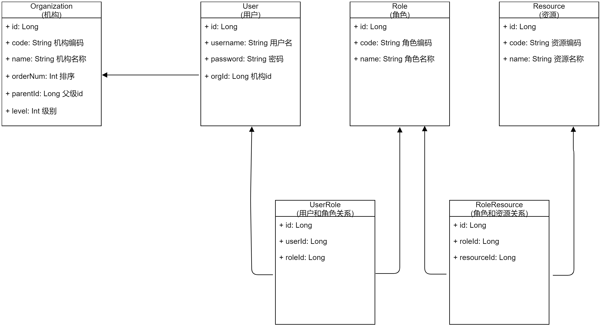
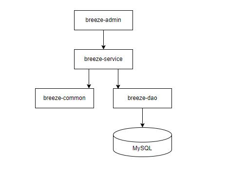
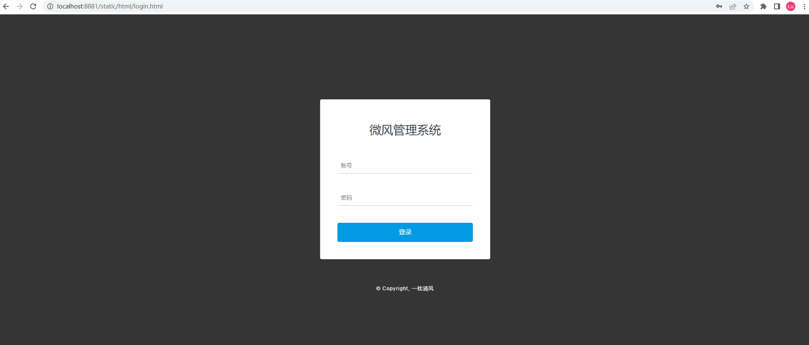
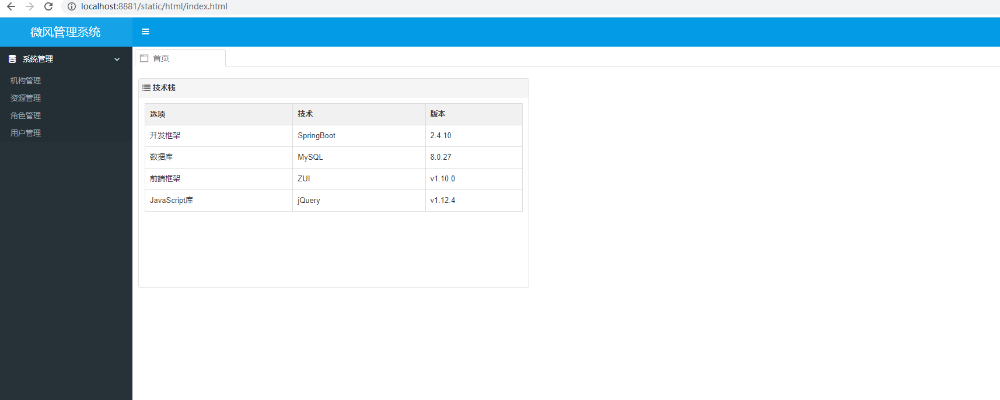
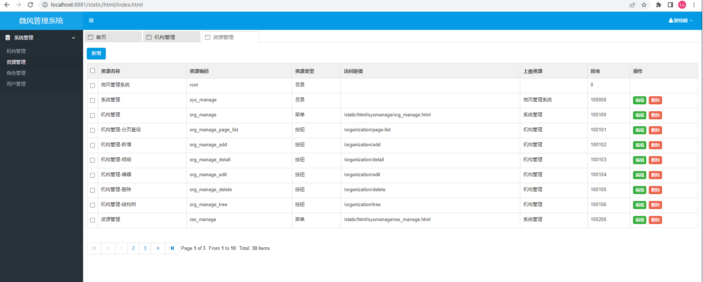
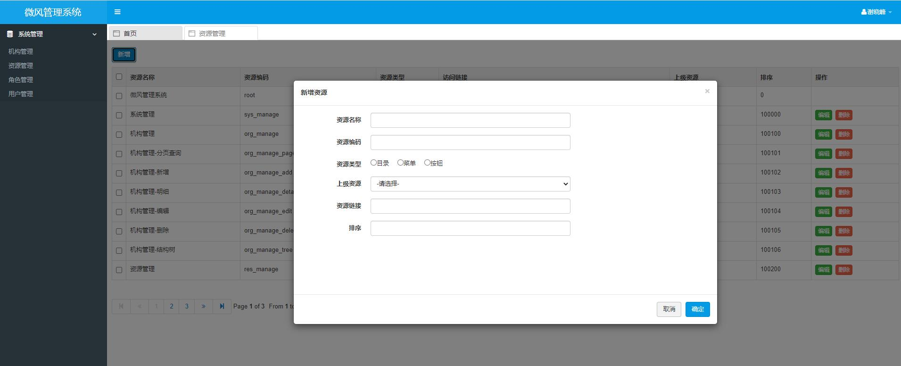

# 微风管理系统
> 一个简单的管理系统开发模板，特点就是简单、简单、再简单。

## 功能介绍
以基本的权限管理(RBAC)功能为案例，实现了以下功能：
* 机构管理
* 资源(权限)管理
* 角色管理
* 用户管理
* 用户登录/退出/修改密码

## 技术栈
| 选项          | 技术         | 版本      |
|-------------|------------|---------|
| 开发框架        | SpringBoot | 2.4.10  |
| 数据库         | MySQL      | 8.0.26  |
| 前端框架        | ZUI        | v1.10.0 |
| JavaScript库 | jQuery     | 1.12.4  |

## 数据库设计



## 项目结构
```
|-breeze
|--breeze-admin    后台管理
|--breeze-common   通用
|--breeze-dao      数据访问层
|--breeze-service  业务层

```
依赖关系：


## 部署说明
1. 创建数据库breeze
2. 导入 breeze-admin/src/main/resources/doc/sql/breeze.sql
3. 启动项目，默认占用 8881 端口
4. 访问：http://localhost:8881/static/html/login.html  用户名: admin 密码: 123456


## 项目截图






